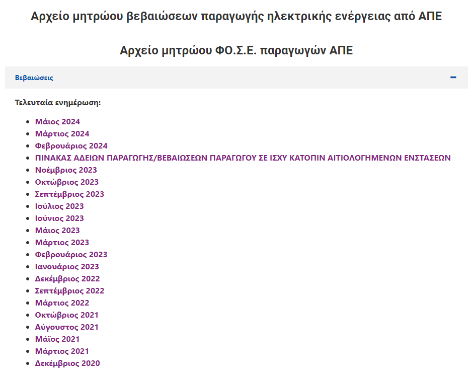

# Forecasting Renewable Energy Permits and Power in Greece: A Comprehensive Tutorial

Andritsoudis Vasilis & Filitsa Ioanna Kouskouveli

<div align="center" id="fig-1">
  <a>
    
  </a>
  <p><b>photo by: <a href="https://www.sourceofasia.com/vietnams-drive-towards-renewable-energy/">https://www.sourceofasia.com/vietnams-drive-towards-renewable-energy/</a></p>
</div>

## Contents
* Introduction
* Presentation of the RAE Permits Dataset
* External Datasets
* Exploratory Data Analysis (EDA) in Streamlit
* Forecasting Methodology 
* In summary

## Introduction

Currently, Greece is making significant strides, by progressively transitioning to sustainable energy sources, hence the Renewable Energy Permits issued by the Regulatory Authority for Energy (<a href="https://www.rae.gr/ape/adeiodotisi-2/adeies-ape/">RAE</a>) play a crucial role in this progress. 

This tutorial will guide you through the process of collecting, analyzing and forecasting these permits and/or the possible power that could be produced by these renewable energy technologies. By the end of it, not only will you be equipped to visualize the current state of renewable energy in Greece but you will also be able to predict future trends using various data science techniques. Whether you're a data enthusiast, a professional in the energy sector or simply interested in renewable energy trends, this tutorial will provide a practical, hands-on approach to understanding and forecasting renewable energy permits and/or power.

## Presentation of the RAE Permits Dataset

The dataset used for this project is sourced from the official site of the Regulatory Authority for Energy (RAE) in Greece. It includes detailed records of renewable energy permits issued across various Greek regions. The data spans from 2001 to 2024 and includes key information such as Permit registration number *-ΑΡΙΘΜΟΣ ΜΗΤΡΩΟΥ ΑΔΕΙΩΝ-*, Application submission date *-ΗΜΕΡΟΜΗΝΙΑ ΥΠΟΒΟΛΗΣ ΑΙΤΗΣΗΣ-*, Permit issue date *-ΗΜΕΡΟΜΗΝΙΑ ΕΚΔ. ΑΔ.ΠΑΡΑΓΩΓΗΣ-*, Permit expiration date *-ΗΜΕΡΟΜΗΝΙΑ ΛΗΞΗΣ ΑΔ.ΠΑΡΑΓΩΓΗΣ-*, Region, regional unit, and municipality of the project *-ΠΕΡΙΦΕΡΕΙΑ, ΠΕΡΙΦΕΡΕΙΑΚΗ ΕΝΟΤΗΤΑ, ΔΗΜΟΣ-*, Maximum power capacity (MW) *-ΜΕΓΙΣΤΗ ΙΣΧΥΣ (MW)-*, Technology used *-ΤΕΧΝΟΛΟΓΙΑ-*.

### Data Collection and Initial Preprocessing

The first step involved <a href="https://www.rae.gr/ape/adeiodotisi-2/adeies-ape/">downloading</a> multiple Excel files corresponding to different months and merging them into a single dataset. The dataset was then preprocessed to ensure consistency and accuracy.

<div align="center" id="fig-1">
  <a>
    
  </a>
</div>

### Identify Possible Problems within the Dataset

More specifically, several challenges were encountered during the preprocessing of the RAE permits dataset like concatenating all excel files containing the data, managing the date formatting, transforming information (so it wouldn’t be lost), checking for duplicate entries and inconsistencies in columns’ contents. All these actions were taken into <a href="https://github.com/VasilisAndritsoudis/rae-forecasting/blob/master/data_processing.ipynb">`data_processing.ipynb`</a> notebook, let’s walk you through them, by examining each one at a time.

To begin with, combining data from multiple excel files into a single cohesive dataset required careful handling to avoid duplicates and ensure consistency. (see the following code snippet)

```python
excel_files = ['2020-12 - Dec.xlsx', '2021-03 - Mar.xlsx', '2021-05 - May.xlsx', '2021-08 - Aug.xlsx', '2021-10 - Oct.xlsx', '2022-03 - Mar.xlsx', '2022-09 - Sep.xlsx', '2022-12 - Dec.xlsx', '2023-01 - Jan.xlsx', '2023-02 - Feb.xlsx', '2023-03 - Mar.xlsx', '2023-05 - May.xlsx', '2023-06 - Jun.xlsx', '2023-07 - Jul.xlsx', '2023-09 - Sep.xlsx', '2023-10 - Oct.xlsx', '2023-11 - Nov.xlsx', '2024-02 - Feb.xlsx', '2024-03 - Mar.xlsx']

excel_cols = ['AΡΙΘΜΟΣ ΜΗΤΡΩΟΥ ΑΔΕΙΩΝ', 'ΗΜΕΡΟΜΗΝΙΑ ΥΠΟΒΟΛΗΣ ΑΙΤΗΣΗΣ', 'ΗΜΕΡΟΜΗΝΙΑ ΕΚΔ. ΑΔ.ΠΑΡΑΓΩΓΗΣ', 'ΗΜΕΡΟΜΗΝΙΑ ΛΗΞΗΣ ΑΔ.ΠΑΡΑΓΩΓΗΣ', 'ΠΕΡΙΦΕΡΕΙΑ', 'ΠΕΡΙΦΕΡΕΙΑΚΗ ΕΝΟΤΗΤΑ', 'ΔΗΜΟΣ', 'ΜΕΓΙΣΤΗ ΙΣΧΥΣ (MW)', 'ΤΕΧΝΟΛΟΓΙΑ']

df = pd.DataFrame()
for excel_file in excel_files:
    df_excel =  pd.read_excel('data\\permits\\' + excel_file, usecols=excel_cols, skiprows=[0])
    
    df = pd.concat([df,df_excel]).drop_duplicates().reset_index(drop=True)
```

Additionally, the dates needed to be converted into more useful formats for analysis. This included converting them to week/year and month/year formats and dropping any records containing NAs in the respective columns. Apart from that, it was important not to lose the information provided by columns like the *ΗΜΕΡΟΜΗΝΙΑ ΥΠΟΒΟΛΗΣ ΑΙΤΗΣΗΣ* column or the *ΕΒΔΟΜΑΔΑ ΕΚΔ. ΑΔ.ΠΑΡΑΓΩΓΗΣ* column. 

In order to do so, we calculated the approval interval, which is the time taken from the submission of the application to the issuance of the permit  along with  the duration of the permits, which is the time from the issuance of the permit to the expiration of the permit. Furthermore, to compensate for the fact that there are leap years, we took the average number of days in a month over a four-year period. (see the following code snippet)

```python
df['ΜΗΝΑΣ ΕΚΔ. ΑΔ.ΠΑΡΑΓΩΓΗΣ'] = df['ΗΜΕΡΟΜΗΝΙΑ ΕΚΔ. ΑΔ.ΠΑΡΑΓΩΓΗΣ'].dt.strftime('%Y-%m')
df['ΕΒΔΟΜΑΔΑ ΕΚΔ. ΑΔ.ΠΑΡΑΓΩΓΗΣ'] = df['ΗΜΕΡΟΜΗΝΙΑ ΕΚΔ. ΑΔ.ΠΑΡΑΓΩΓΗΣ'].dt.strftime('%Y-%W')

df['ΔΙΑΣΤΗΜΑ ΕΓΚΡΙΣΗΣ ΣΕ ΜΗΝΕΣ'] = ((df['ΗΜΕΡΟΜΗΝΙΑ ΕΚΔ. ΑΔ.ΠΑΡΑΓΩΓΗΣ'] - df['ΗΜΕΡΟΜΗΝΙΑ ΥΠΟΒΟΛΗΣ ΑΙΤΗΣΗΣ']) / (((0.75 * 365) + (0.25 * 366)) / 12)).dt.days  # We explicitly define one month to be 30.4375 days
df['ΔΙΑΣΤΗΜΑ ΕΓΚΡΙΣΗΣ ΣΕ ΕΒΔΟΜΑΔΕΣ'] = ((df['ΗΜΕΡΟΜΗΝΙΑ ΕΚΔ. ΑΔ.ΠΑΡΑΓΩΓΗΣ'] - df['ΗΜΕΡΟΜΗΝΙΑ ΥΠΟΒΟΛΗΣ ΑΙΤΗΣΗΣ']) / np.timedelta64(1, 'W')).astype(int)

df['ΔΙΑΡΚΕΙΑ ΑΔΕΙΑΣ ΣΕ ΜΗΝΕΣ'] = ((df['ΗΜΕΡΟΜΗΝΙΑ ΛΗΞΗΣ ΑΔ.ΠΑΡΑΓΩΓΗΣ'] - df['ΗΜΕΡΟΜΗΝΙΑ ΕΚΔ. ΑΔ.ΠΑΡΑΓΩΓΗΣ']) / (((0.75 * 365) + (0.25 * 366)) / 12)).dt.days  # We explicitly define one month to be 30.4375 days
df['ΔΙΑΡΚΕΙΑ ΑΔΕΙΑΣ ΣΕ ΕΒΔΟΜΑΔΕΣ'] = ((df['ΗΜΕΡΟΜΗΝΙΑ ΛΗΞΗΣ ΑΔ.ΠΑΡΑΓΩΓΗΣ'] - df['ΗΜΕΡΟΜΗΝΙΑ ΕΚΔ. ΑΔ.ΠΑΡΑΓΩΓΗΣ']) / np.timedelta64(1, 'W')).astype(int)
```

Lastly, duplicate entries were identified -based on the permit registration number- and removed, keeping only the latest entry.

```python
dups_df = df[df.duplicated(subset=['AΡΙΘΜΟΣ ΜΗΤΡΩΟΥ ΑΔΕΙΩΝ'], keep='first')]
df = pd.concat([df, dups_df, dups_df]).drop_duplicates(keep=False).reset_index(drop=True)
```

## External Datasets

In addition to the RAE permits dataset, two external datasets were introduced to enhance both the exploratory data analysis and the forecasting model for renewable energy permits and power in Greece. These datasets provided interesting context and additional variables that could influence renewable energy projects.

### CO2 Price Data

The CO2 price data, sourced from <a href="https://www.investing.com/">Investing.com</a> - Carbon Emissions Historical Data, was incorporated into the forecasting model under the hypothesis that CO2 prices can significantly influence the interest in renewable energy technologies. Higher CO2 prices make renewable energy more attractive as a cost-effective alternative to fossil fuels. Therefore, including CO2 price data in our scope helps account for its potential impact on the number of renewable energy permits issued.

To utilize the CO2 price data, it was first downloaded and preprocessed to align with the time series of the permits data. (see the following code snippet)

```python
carbon_df = pd.read_csv('data\\eu_carbon_price\\eu_carbon_monthly_05_today.csv')

carbon_df['Date'] = carbon_df['Date'].astype(str)
carbon_df['Date'] = pd.to_datetime(carbon_df['Date'], errors='coerce')
carbon_df['Date'] = carbon_df['Date'].dt.strftime('%Y-%m')

carbon_price = np.zeros(len(df.index))
for i, carbon_date in enumerate(carbon_df['Date']):
    for j, df_date in enumerate(df['ΜΗΝΑΣ ΕΚΔ. ΑΔ.ΠΑΡΑΓΩΓΗΣ']):
        if carbon_date == df_date:
            carbon_price[j] = carbon_df['Price'][i]
            
df['ΜΗΝΙΑΙΑ ΤΙΜΗ ΔΙΟΞΕΙΔΙΟΥ ΤΟΥ ΑΝΘΡΑΚΑ'] = carbon_price
```

As it can be seen, the CO2 price data was aligned with the permits data to match the corresponding time periods (see <a href="https://github.com/VasilisAndritsoudis/rae-forecasting/blob/master/data_processing.ipynb">`data_processing.ipynb`</a> notebook). This step ensures that the model can leverage the CO2 price as an influencing factor for each time period covered in the permits dataset. Followingly, the processed CO2 price data was then merged with the permits dataset, allowing -later on- the forecasting model to use CO2 price as an additional feature, potentially improving the accuracy and relevance of the predictions.

### Wind Speed Data

The wind speed data, sourced from the <a href="https://geo.rae.gr/?tab=panel-1339">RAE Geospatial Portal</a>, was retrieved and integrated under the hypothesis that average wind speeds in different regions of Greece can indicate the suitability of these regions for wind energy projects. Regions with higher wind speeds are more likely to attract renewable energy projects, thus affecting the number of applications and permits granted. Wind speed measurements at different heights (80m, 100m and 120m) were used to create regional averages, providing an indicator of the potential for wind energy projects.

In more detail, the wind speed data was available in CSV files, with each file containing measurements along with their geographic coordinates (longitude and latitude) - see <a href="https://github.com/VasilisAndritsoudis/rae-forecasting/blob/master/preprocess_%20wind_power_data.py">`preprocess_ wind_power_data.py`</a> file. As a consequence, the data was first converted to a GeoDataFrame and reprojected to a geographic coordinate reference system (<a href="https://gadm.org/download_country.html">CRS</a>). (see the following code snippet)

```python
def process_csv_file(csv_file_path):
    df = pd.read_csv(csv_file_path, delimiter=';', header=None, dtype=str)
    
    # Rename the columns for better understanding
    df.columns = ['Longitude', 'Latitude', 'Wind_Speed']
    
    # Convert the Longitude and Latitude columns to numeric types
    df['Longitude'] = pd.to_numeric(df['Longitude'], errors='coerce')
    df['Latitude'] = pd.to_numeric(df['Latitude'], errors='coerce')
    
    # Drop rows with invalid values
    df = df.dropna(subset=['Longitude', 'Latitude'])
    
    # Create a GeoDataFrame
    geometry = gpd.points_from_xy(df['Longitude'], df['Latitude'])
    gdf_csv = gpd.GeoDataFrame(df, geometry=geometry, crs="EPSG:2100")
    
    # Re-project the coordinates to a geographic CRS (EPSG:4326)
    gdf_csv = gdf_csv.to_crs(epsg=4326)
    
    # Extract the transformed coordinates
    df['Longitude'] = gdf_csv.geometry.x
    df['Latitude'] = gdf_csv.geometry.y
    
    return df
```

Afterwards, the processed wind speed data was integrated with regional shapefiles to calculate average wind speeds for each region, at different heights (see <a href="https://github.com/VasilisAndritsoudis/rae-forecasting/blob/master/wind_speed_aggregations.py">`wind_speed_aggregations.py`</a> file). This involved spatial joining and aggregation to derive regional averages. (see the following code snippet)

In other words, by processing and incorporating the wind speed data, regional averages were calculated, providing valuable indicators for the potential of wind energy projects in different regions. This information was subsequently used to enhance the forecasting model, allowing for more accurate predictions of renewable energy permits and/or power based on regional suitability for wind energy projects.

```python
def calculate_groupBy_avgs(csv_path, gdf_map, groupby_list_of_cols, calculation_col, char, aggr_mean_df):
    df = pd.read_csv(csv_path, delimiter=';')
    df = df.rename(columns=lambda x: x.lower())
    df = df[~(df == 0).any(axis=1)]

    # Convert CSV data to GeoDataFrame
    gdf = gpd.GeoDataFrame(
        df, 
        geometry=gpd.points_from_xy(df.longitude, df.latitude),
        crs="EPSG:4326"
    )
    
    # Spatial join to map points to municipalities and districts
    gdf = gpd.sjoin(gdf, gdf_map, how="left", op="within")

    # Calculate mean wind speed for each municipality and district
    mean_df = gdf.groupby(groupby_list_of_cols, as_index=False)[calculation_col].mean()
    
    # Rename wind_speed column to wind_speed_avg_{char}
    mean_df = mean_df.rename(columns={calculation_col: f'{calculation_col}_avg_{char}'})
    #print(f"mean_df for {char}:");print(mean_df.head())
    
    # Merge with the aggregated DataFrame
    if aggr_mean_df.empty:
        aggr_mean_df = mean_df
    else:
        aggr_mean_df = pd.merge(aggr_mean_df, mean_df, on=groupby_list_of_cols, how='outer')

    return aggr_mean_df
```

## Exploratory Data Analysis (EDA) in Streamlit

### Raw Data Plots

Building on the comprehensive overview of the RAE permits dataset and the incorporation of external datasets such as CO2 price and wind speed measurements, the next step involves conducting an Exploratory Data Analysis (EDA) using Streamlit (see <a href="https://github.com/VasilisAndritsoudis/rae-forecasting/blob/master/streamlit_app.py">`streamlit_app.py`</a> file). This interactive analysis allows users to delve deeper into the data, uncovering trends and insights that would/could inform the forecasting models. Through various visualizations, users can explore the dataset's attributes, understand regional and technological variations and assess the temporal dynamics of renewable energy permits in Greece.

For time series visualization, users have the freedom to select the time period (monthly or weekly), attribute type (maximum power or number of permits), and time series type (renewable energy permits, CO2 price, or both). This flexibility intends to allow users to analyze trends over time and understand the relationship between these variables. (see the following code snippet)

```python
def visualize_timeseries(df: pd.DataFrame, period_options, attribute_type_options, timeseries_type_options):
    column = ''
    co2_column = ''
    if period_options == 'Μήνας':
        column = 'ΜΗΝΑΣ ΕΚΔ. ΑΔ.ΠΑΡΑΓΩΓΗΣ'
        co2_column = 'ΜΗΝΙΑΙΑ ΤΙΜΗ ΔΙΟΞΕΙΔΙΟΥ ΤΟΥ ΑΝΘΡΑΚΑ'
    elif period_options == 'Εβδομάδα':
        column = 'ΕΒΔΟΜΑΔΑ ΕΚΔ. ΑΔ.ΠΑΡΑΓΩΓΗΣ'
        co2_column = 'ΕΒΔΟΜΑΔΙΑΙΑ ΤΙΜΗ ΔΙΟΞΕΙΔΙΟΥ ΤΟΥ ΑΝΘΡΑΚΑ'

    st_df = pd.DataFrame()
    if 'Α.Π.Ε.' in timeseries_type_options and 'Τιμή CO2' in timeseries_type_options:
        rae_df = pd.DataFrame()
        if 'Μέγιστη Ισχύς (MW)' in attribute_type_options:
            rae_df = df[[column, 'ΜΕΓΙΣΤΗ ΙΣΧΥΣ (MW)']].groupby(column).sum().reset_index()
        elif 'Αριθμός Α.Π.Ε' in attribute_type_options:
            rae_df = df.groupby(column).size().reset_index()

        co2_tf = df[[column, co2_column]].groupby(column).sum().reset_index()
        st_df = rae_df.merge(co2_tf, on=column)
    elif 'Α.Π.Ε.' in timeseries_type_options:
        if 'Μέγιστη Ισχύς (MW)' in attribute_type_options:
            st_df = df[[column, 'ΜΕΓΙΣΤΗ ΙΣΧΥΣ (MW)']].groupby(column).sum().reset_index()
        elif 'Αριθμός Α.Π.Ε' in attribute_type_options:
            st_df = df.groupby(column).size().reset_index()
    elif 'Τιμή CO2' in timeseries_type_options:
        st_df = df[[column, co2_column]].groupby(column).sum().reset_index()

    st_df = st_df.rename(columns={column: 'index'}).set_index('index')
    st.line_chart(st_df)
```

For regional data visualization, users can select specific regions and attribute types to generate tables and bar charts that display the summarized data per region. This helps in understanding the geographic distribution and regional performance and trends in renewable energy projects.(see the following code snippet)

```python
def visualize_data_per_region(df: pd.DataFrame, attribute_type_options, region_options):

    ...

    if 'Μέγιστη Ισχύς (MW)' in attribute_type_options:
        st_df = df[['ΠΕΡΙΦΕΡΕΙΑ', 'ΜΕΓΙΣΤΗ ΙΣΧΥΣ (MW)']].groupby('ΠΕΡΙΦΕΡΕΙΑ').sum().reset_index()
        
        ...

        st.table(st_df)
        st_df.drop('ΜΕΓΙΣΤΗ ΙΣΧΥΣ (MW)', axis=1, inplace=True)
        st.bar_chart(st_df)
    elif 'Αριθμός Α.Π.Ε' in attribute_type_options:
        st_df = df[['ΠΕΡΙΦΕΡΕΙΑ']].groupby('ΠΕΡΙΦΕΡΕΙΑ').size().to_frame('ΣΥΝΟΛΟ').reset_index()
        
        ...

        st.table(st_df)
        st_df.drop('ΣΥΝΟΛΟ', axis=1, inplace=True)
        st.bar_chart(st_df)
```

In addition to regional analysis, users can explore data based on different renewable energy technologies and attribute types to generate tables and bar charts that display the summarized data per technology. This interaction provides insights into the performance and distribution of different renewable energy technologies. On tope of that, it helps in understanding which technologies are more prevalent or successful in different regions (see the following code snippet)

```python
def visualize_data_per_technology(df: pd.DataFrame, attribute_type_options, tech_options):

    ...

    if 'Μέγιστη Ισχύς (MW)' in attribute_type_options:
        st_df = df[['ΤΕΧΝΟΛΟΓΙΑ', 'ΜΕΓΙΣΤΗ ΙΣΧΥΣ (MW)']].groupby('ΤΕΧΝΟΛΟΓΙΑ').sum().reset_index()
        
        ...

        st.table(st_df)
        st_df.drop('ΜΕΓΙΣΤΗ ΙΣΧΥΣ (MW)', axis=1, inplace=True)
        st.bar_chart(st_df)
    elif 'Αριθμός Α.Π.Ε' in attribute_type_options:
        st_df = df[['ΤΕΧΝΟΛΟΓΙΑ']].groupby('ΤΕΧΝΟΛΟΓΙΑ').size().to_frame('ΣΥΝΟΛΟ').reset_index()
        
        ...

        st.table(st_df)
        st_df.drop('ΣΥΝΟΛΟ', axis=1, inplace=True)
        st.bar_chart(st_df)
```

Furthermore, to analyze the duration for permit issuance and approval, users can visualize the average duration per region or per technology, by  selecting the period type (permit duration or approval duration) and view the average duration for the selected column (region or technology), respectively.Thus,  a clear view of the time taken for different stages of the permitting process is obtained, helping to understand the efficiency of the permitting process and to identify any bottlenecks.

```python
def visualize_duration_per_column(df: pd.DataFrame, column, period_options):
    st_df = pd.DataFrame()
    if period_options == 'Διάρκεια Α.Π.Ε.':
        st_df = df[[column, 'ΔΙΑΡΚΕΙΑ ΑΔΕΙΑΣ ΣΕ ΜΗΝΕΣ']].groupby(column).mean().reset_index()
        st_df['ΔΙΑΡΚΕΙΑ ΑΔΕΙΑΣ ΣΕ ΜΗΝΕΣ'] = st_df['ΔΙΑΡΚΕΙΑ ΑΔΕΙΑΣ ΣΕ ΜΗΝΕΣ'].astype(int)
    elif period_options == 'Διάστημα Έγκρισης Α.Π.Ε.':
        st_df = df[[column, 'ΔΙΑΣΤΗΜΑ ΕΓΚΡΙΣΗΣ ΣΕ ΜΗΝΕΣ']].groupby(column).mean().reset_index()
        st_df['ΔΙΑΣΤΗΜΑ ΕΓΚΡΙΣΗΣ ΣΕ ΜΗΝΕΣ'] = st_df['ΔΙΑΣΤΗΜΑ ΕΓΚΡΙΣΗΣ ΣΕ ΜΗΝΕΣ'].astype(int)

    st.table(st_df)
    st_df = st_df.rename(columns={column: 'index'}).set_index('index')
    st.bar_chart(st_df)
```

### Plot Data on Map

Aside from the aforementioned plots, and in order to provide a spatial perspective on the renewable energy permits data, the visualize_map_per_region function allows users to plot data on a map. This visualization helps users understand the geographic distribution of renewable energy projects across different regions and technologies. In fact, the map highlights the number of projects and their locations, giving a clear view of where renewable energy initiatives are concentrated.

The function takes into account the selected regions and technologies, aggregates the data, and then uses Plotly to display an interactive map. The color and size of the markers on the map correspond to different technologies and the number of permits, respectively.

```python
def visualize_map_per_region(df: pd.DataFrame, region_options, tech_options):
    tech_values = {}
    for tech in tech_options:
        tech_values[tech] = []

    df = df[df['ΠΕΡΙΦΕΡΕΙΑ'].isin(region_options)]
    df = df[df['ΤΕΧΝΟΛΟΓΙΑ'].isin(tech_options)]
    region_options.sort()

    st_df = df[['ΠΕΡΙΦΕΡΕΙΑ']].groupby('ΠΕΡΙΦΕΡΕΙΑ').size().to_frame('ΣΥΝΟΛΟ').reset_index()
    for region in region_options:
        if region not in st_df['ΠΕΡΙΦΕΡΕΙΑ'].tolist():
            st_df.loc[-1] = [region, 0]

    st_df = st_df.sort_values('ΠΕΡΙΦΕΡΕΙΑ')

    for region in region_options:
        tmp_df = df.loc[df['ΠΕΡΙΦΕΡΕΙΑ'] == region]
        for tech in tech_options:
            tmp2_df = tmp_df.loc[tmp_df['ΤΕΧΝΟΛΟΓΙΑ'] == tech]
            tmp2_df = tmp2_df[['ΤΕΧΝΟΛΟΓΙΑ']].groupby('ΤΕΧΝΟΛΟΓΙΑ').size().to_frame('ΣΥΝΟΛΟ').reset_index()
            if len(tmp2_df['ΣΥΝΟΛΟ'] > 0):
                tech_values[tech].append(tmp2_df['ΣΥΝΟΛΟ'][0])
            else:
                tech_values[tech].append(0)

    for tech in tech_options:
        st_df[tech] = tech_values[tech]

    map_df = pd.DataFrame(st_df['ΠΕΡΙΦΕΡΕΙΑ'])
    st_df = st_df.rename(columns={'ΠΕΡΙΦΕΡΕΙΑ': 'index'}).set_index('index')

    ...

    lat, lon, color = [], [], []
    for reg in map_df['ΠΕΡΙΦΕΡΕΙΑ']:
        coordinates = region_coordinates[reg]
        lat.append(coordinates['lat'])
        lon.append(coordinates['lon'])
        color.append(coordinates['color'])

    map_df['lat'], map_df['lon'], map_df['color'] = lat, lon, color

    st.table(st_df)
    st.map(
        map_df,
        latitude='lat', longitude='lon',
        color='color', size=15000, zoom=5
    )
```

As it can be seen int the above code snippet, the function first filters the dataset based on the selected regions and technologies. It then aggregates the number of permits per region and technology, storing the results in a DataFrame. The coordinates and colors for each region are predefined in a dictionary, which the function uses to create a map DataFrame. Finally, the map is plotted in our Streamlite app, providing an interactive and visually appealing way to explore the geographic distribution of renewable energy projects across Greece.

## Forecasting Methodology

After conducting an in-depth Exploratory Data Analysis (EDA) using Streamlit, the next step involves developing a forecasting methodology to predict the future number of renewable energy permits and/or their associated power output in Greece (see <a href="https://github.com/VasilisAndritsoudis/rae-forecasting/blob/master/forecasting_models.py">`forecasting_models.py`</a> file). This section describes the preprocessing steps, various forecasting models implemented and the interactive options available for users.

Before applying forecasting models, it would be important to note that the data is primarily transformed based on the chosen time period (monthly or weekly). This involves aggregating the data to the selected time level and preparing it for forecasting (see transform_data_on_time_level function).

### Forecasting Models

Various forecasting models are employed to predict the number of permits and total MW production, like a SARIMA, Random Forest, a XGBoost and a Prophet model, since each one offers different strengths and capabilities. The models' predictions are evaluated using metrics like Mean Squared Error (MSE) and R-squared (R²). The forecasts are then plotted to visualize the predictions against the historical data. In the following code snippet, one can observe the respective code’s structure and logic.

```python
def predict_with_dif_models(hist_data, k, target_var, time_col, freq, lags=4):
    models_predictions_list = []

    train_data = hist_data.iloc[:-k]
    test_data = hist_data.iloc[-k:]

    hist_data_lagged = create_lagged_features(hist_data, target_var, lags)
    train_data_lagged = hist_data_lagged.iloc[:-k]
    test_data_lagged = hist_data_lagged.iloc[-k:]

    # Forecast for the next k periods
    sarima_predictions = sarima_model(train_data, k, target_var, freq)
    models_predictions_list.append(('SARIMA', sarima_predictions))

    rf_predictions = random_forest_model(train_data_lagged, test_data_lagged, target_var, time_col)
    models_predictions_list.append(('Random Forest', rf_predictions))

    xgb_predictions = xgboost_model(train_data_lagged, test_data_lagged, target_var, time_col)
    models_predictions_list.append(('XGBoost', xgb_predictions))

    prophet_predictions = prophet_model(hist_data, k, target_var, time_col)
    models_predictions_list.append(('Prophet', prophet_predictions['yhat'].values))

    for model_name, predictions in models_predictions_list:
        st.write(f"### {model_name} Predictions")
        # Round the predictions to the nearest integer
        if target_var == 'num_permits':
            predictions = predictions.round()

        # Evaluate the model
        evaluate_model(test_data, predictions, target_var)

        # Plot the forecast
        plot_forecast(hist_data, predictions, train_data, k, target_var, time_col, freq)
```

### Interactive Forecasting with Streamlit

Moreover, users can interact with the forecasting app by selecting the frequency (weekly or monthly), target variable (number of permits or total MW), number of periods to forecast, and number of lags for lagged features. (see the following code snippet)

```python
...

    st.title("Ανάλυση Forecasting Μοντέλων")

    if period_options == 'Εβδομάδα':
        cols_to_drop_list = ['start_production_month', 'approval_period_in_months', 'approved_time_in_months',
                                'monthly_co2_price']
        time_col = 'start_production_week'
        time_period = 'W'
    else:
        cols_to_drop_list = ['start_production_week', 'approval_period_in_weeks', 'approved_time_in_weeks',
                                'weekly_co2_price']
        time_col = 'start_production_month'
        time_period = 'M'

    if attribute_type_options == 'Μέγιστη Ισχύς (MW)':
        target_var = 'total_mw'
    else:
        target_var = 'num_permits'

    k = st.slider('Επιλογή περιόδου πρόβλεψης', 1, 50, 20)
    lags = st.slider('Επιλογή διαστήματος καθυστέρησης (Lag)', 1, 20, 4)

    df_aggr = fm.transform_data_on_time_level(df_fm, cols_to_drop_list, time_col, time_period)

    if st.button('Πρόβλεψη'):
        fm.predict_with_dif_models(df_aggr, k, target_var, time_col, time_period, lags)

...
```

By providing various forecasting models and interactive options, this methodology enables users to predict future trends in renewable energy permits and/or power output in Greece accurately. The combination of preprocessing, transformation and multiple models aims to ensure more robust and reliable forecasts in the renewable energy sector.

### Forecasting API

Building upon the forecasting methodology described earlier, where various models such as SARIMA and Prophet were employed to predict renewable energy permits and/or power output, a next step would be to make these forecasts accessible through the development of a forecasting API. The forecasting API allows users to interact with the models via HTTP requests, thus allowing them to predict the future number of renewable energy permits and/or their associated power output. The API is built using Flask and serves predictions generated by SARIMA and Prophet models. (see <a href="https://github.com/VasilisAndritsoudis/rae-forecasting/blob/master/forecasting_api.py">`forecasting_api.py`</a> file)

The API is initialized by loading the dataset, preprocessing it, transforming it for the selected time periods and training the models, on all the available data. (see the following code snippet)

```python
if __name__ == '__main__':
    df = pd.read_csv('results\\final_permits.csv')
    df = fm.preprocess_data(df)

    cols_to_drop_list_month = ['start_production_week', 'approval_period_in_weeks', 'approved_time_in_weeks', 'weekly_co2_price']
    df_train_month = fm.transform_data_on_time_level(df, cols_to_drop_list_month, 'start_production_month', 'M')

    cols_to_drop_list_week = ['start_production_month', 'approval_period_in_months', 'approved_time_in_months', 'monthly_co2_price']
    df_train_week = fm.transform_data_on_time_level(df, cols_to_drop_list_week, 'start_production_week', 'W')

    sarima_model_month_num_permits = fm.sarima_model_train(df_train_month, 'num_permits', 'M')
    prophet_model_month_num_permits = fm.prophet_model_train(df_train_month, 'num_permits', 'start_production_month')

    ...

    sarima_model_week_total_mw = fm.sarima_model_train(df_train_week, 'total_mw', 'W')
    prophet_model_week_total_mw = fm.prophet_model_train(df_train_week, 'total_mw', 'start_production_week')

    app.run()
```

It provides endpoints for both monthly and weekly forecasts and for different target variables (i.e. the number of permits and total MW production). Some indicative examples are provided bellow.

```python
app = Flask(__name__)


@app.route('/prophet/month/num_permits', methods=['GET'])
def prophet_month_num_permits():
    k = int(request.args['future'])
    future = prophet_model_month_num_permits.make_future_dataframe(periods=k, include_history=False)
    forecast = prophet_model_month_num_permits.predict(future)
    predictions = forecast['yhat'].values
    return predictions.tolist()


@app.route('/prophet/month/total_mw', methods=['GET'])
def prophet_month_total_mw():
    k = int(request.args['future'])
    future = prophet_model_month_total_mw.make_future_dataframe(periods=k, include_history=False)
    forecast = prophet_model_month_total_mw.predict(future)
    predictions = forecast['yhat'].values
    return predictions.tolist()

...

@app.route('/sarima/month/num_permits', methods=['GET'])
def sarima_month_num_permits():
    k = int(request.args['future'])
    forecast = sarima_model_month_num_permits.forecast(steps=k)
    return loads(forecast.to_json(orient='records'))


@app.route('/sarima/month/total_mw', methods=['GET'])
def sarima_month_total_mw():
    k = int(request.args['future'])
    forecast = sarima_model_month_total_mw.forecast(steps=k)
    return loads(forecast.to_json(orient='records'))

...
```

## In Summary

Summarizing, this Medium article walked you through the entire process of forecasting renewable energy permits and/or power output in Greece. We began by collecting and preprocessing the RAE permits dataset, ensuring consistency and accuracy. This involved merging multiple Excel files, handling date formats, and removing duplicates. Next, we enriched our analysis by integrating CO2 price data and wind speed measurements. These external datasets provided additional context and improved the forecasting models' accuracy.

Following this, we conducted an interactive Exploratory Data Analysis (EDA) using Streamlit. This step allowed us to visualize the dataset's attributes, explore regional and technological variations, and assess the temporal dynamics of renewable energy permits in Greece. Various plots were created to analyze time series data, regional data, technology-based data, and permit issuance durations. Additionally, we utilized the visualize_map_per_region function to plot renewable energy permits data on an interactive map. This provided a spatial perspective and highlighted the geographic distribution of renewable energy projects.

Subsequently, we developed a robust forecasting methodology using different models like SARIMA, Prophet, Random Forest, and XGBoost. This involved detailed preprocessing steps, data transformation based on chosen time periods, and the evaluation of model predictions using metrics like MSE and R-squared. To enhance user experience, we enabled interactive forecasting with Streamlit. Users could select various parameters such as frequency, target variable, forecast periods, and lags. This interactivity offered a hands-on approach to predicting future trends in renewable energy permits and power output.

Finally, we made these forecasts accessible through a forecasting API built using Flask. This API allows users to interact with the models via HTTP requests, making predictions for both monthly and weekly forecasts and different target variables.

By following this tutorial, you now have a practical, hands-on approach to understanding and forecasting renewable energy permits and power in Greece. Hopefully, you are equipped with the tools (see our <a href="https://github.com/VasilisAndritsoudis/rae-forecasting">GitHub repo</a>) and knowledge to visualize and predict future trends in renewable energy, contributing to the ongoing transition to sustainable energy sources in Greece.

